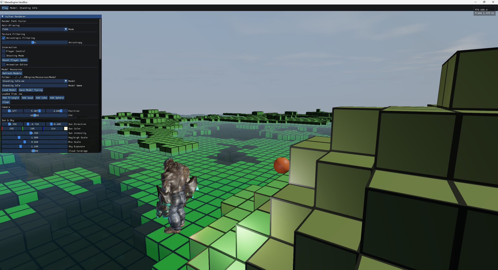
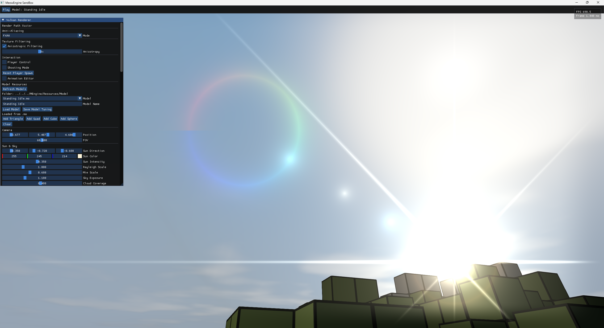
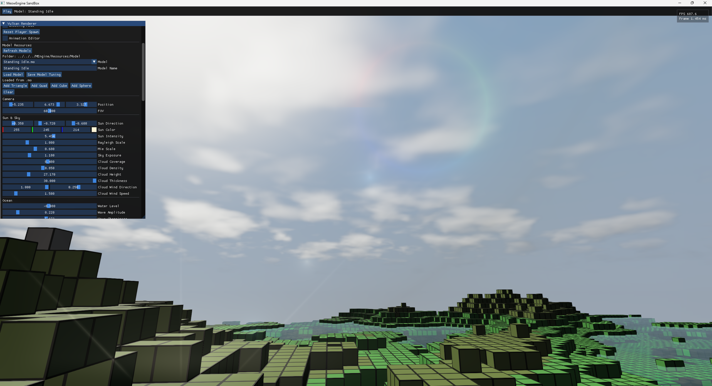

# MeowEngine

`MEngine` is a static C++17 engine library. `SandBox` is the executable project that links against the engine and exercises the current rendering, camera, terrain streaming, and asset baking paths.

## Gallery







## Implemented

- SDL3 window creation and application loop.
- Camera controller, input, audio, physics, and animation system stubs wired into the engine tick.
- Render backend abstraction with a Vulkan implementation built on NVRHI.
- Vulkan swapchain, device, buffers, images, shaders, ImGui layer, and render thread scaffolding.
- Deferred-style primitive rendering into a G-buffer with PBR lighting composite.
- Procedural sky, cloud, and water compute passes.
- Post-process anti-aliasing controls in ImGui: Off, FXAA, simple TAA history accumulation, and 2x/4x/8x MSAA with G-buffer resolve.
- Runtime texture filtering controls in ImGui, including anisotropic filtering when supported by the Vulkan device.
- Water rendering supports above-water refraction and underwater scene visibility with distance absorption.
- Optional Vulkan ray tracing prototype path with BLAS/TLAS rebuilds for the generated primitive world.
- Procedural primitive terrain world in `SandBox`, now tuned for deeper valleys, larger height ranges, and wider default view distance.
- Asynchronous terrain chunk generation with enkiTS; completed chunk snapshots are published to the renderer without touching Vulkan objects from worker threads.
- Minecraft-style first-person interaction in the sandbox: left click places a cube by default, or fires small physics spheres when `Shooting Mode` is enabled in ImGui.
- Engine-side terrain collision baking into a sparse voxel octree for faster broad-phase queries. Collision rebuilds run asynchronously so block placement does not stall the render frame.
- Engine-side prototype sphere physics: visible spheres fall under gravity, collide with the baked terrain volume, and lose energy as they bounce.
- Separate static and dynamic primitive submission in the Vulkan renderer, so physics objects update without rebuilding the full terrain mesh each frame.
- Shared engine mesh asset definitions for vertices, surfaces, materials, skeletons, and animation clips.
- `.mo` binary mesh asset save/load helpers for fast engine-side loading.
- `MeowAssetBaker` tool that imports common model formats, including FBX, through Assimp and bakes them into `.mo` files.
- Shader compilation through the Vulkan SDK tools during the CMake build.

## Libraries

- [NVRHI](https://github.com/NVIDIA-RTX/NVRHI): graphics abstraction used by the Vulkan renderer.
- [SDL3](https://github.com/libsdl-org/SDL): windowing and platform input foundation.
- [spdlog](https://github.com/gabime/spdlog): logging.
- [Dear ImGui](https://github.com/ocornut/imgui): runtime renderer controls.
- [glm](https://github.com/g-truc/glm): engine math types and camera matrices.
- [Assimp](https://github.com/assimp/assimp): model import for the asset baking pipeline.
- [enkiTS](https://github.com/dougbinks/enkiTS): task scheduler for asynchronous terrain loading.
- Vulkan SDK: Vulkan loader plus `glslc` and `glslangValidator` for shader compilation.

`NVRHI`, `SDL`, `spdlog`, and `imgui` live under `ThirdParty/`. `glm`, `Assimp`, and `enkiTS` are fetched by CMake through `FetchContent`.

## Layout

```text
MeowEngine/
  CMakeLists.txt
  ThirdParty/
    imgui/
    NVRHI/
    SDL/
    spdlog/
  MEngine/
    Resources/Shader/
    include/MEngine/
      Camera/
      Windows/
      RenderBackend/
        Vulkan/
          VulkanBuffer.hpp
          VulkanCommandContext.hpp
          VulkanDevice.hpp
          VulkanImage.hpp
          VulkanRenderThread.hpp
          VulkanRHI.hpp
          VulkanSwapchain.hpp
          VulkanUtils.hpp
      Physics/
        TerrainCollision.hpp
      Audio/
      InputSystem/
      AnimationSystem/
      Resources/
        MeshAsset.hpp
    src/
      RenderBackend/
        Vulkan/
      Resources/
        MeshAsset.cpp
      Physics/
        TerrainCollision.cpp
  SandBox/
    CMakeLists.txt
    src/AssetBaker.cpp
    src/PrimitiveWorld.hpp
    src/PrimitiveWorld.cpp
    src/main.cpp
```

## Build

Install the Vulkan SDK first and make sure `VULKAN_SDK` points to it. The build needs `vulkan-1`, `glslc`, and `glslangValidator`.

```powershell
cmake -S . -B build
cmake --build build --config Debug
```

Run the sandbox:

```powershell
.\build\bin\Debug\SandBox.exe
.\build\bin\Debug\SandBox.exe --api vulkan
.\build\bin\Debug\SandBox.exe --api vulkan --rt
```

Useful sandbox options:

- `--api vulkan` or `--api d3d12`
- `--rt` enables the Vulkan ray tracing prototype path and forces Vulkan.
- `--seed <number>` chooses the procedural terrain seed.
- `--view-distance <chunks>` controls async terrain streaming radius.
- The default sandbox view distance is 4 chunks and can be raised up to 6 chunks.
- `--world-chunks <count>` controls procedural world bounds.

For single-config generators, executables may be under `build/bin/` instead of `build/bin/Debug/`.

## Asset Baking

`MeowAssetBaker` imports source models with Assimp and writes the engine binary mesh format:

```powershell
.\build\bin\Debug\MeowAssetBaker.exe path\to\model.fbx path\to\model.mo
```

The `.mo` format currently stores:

- mesh vertices with position, normal, color, UV, tangent, bone indices, and bone weights
- 32-bit indices
- mesh surfaces and material slots
- material names, base color, metallic/roughness values, and texture paths
- skeleton joints with parent indices and inverse bind matrices
- animation clips with per-joint translation, rotation, and scale keys
